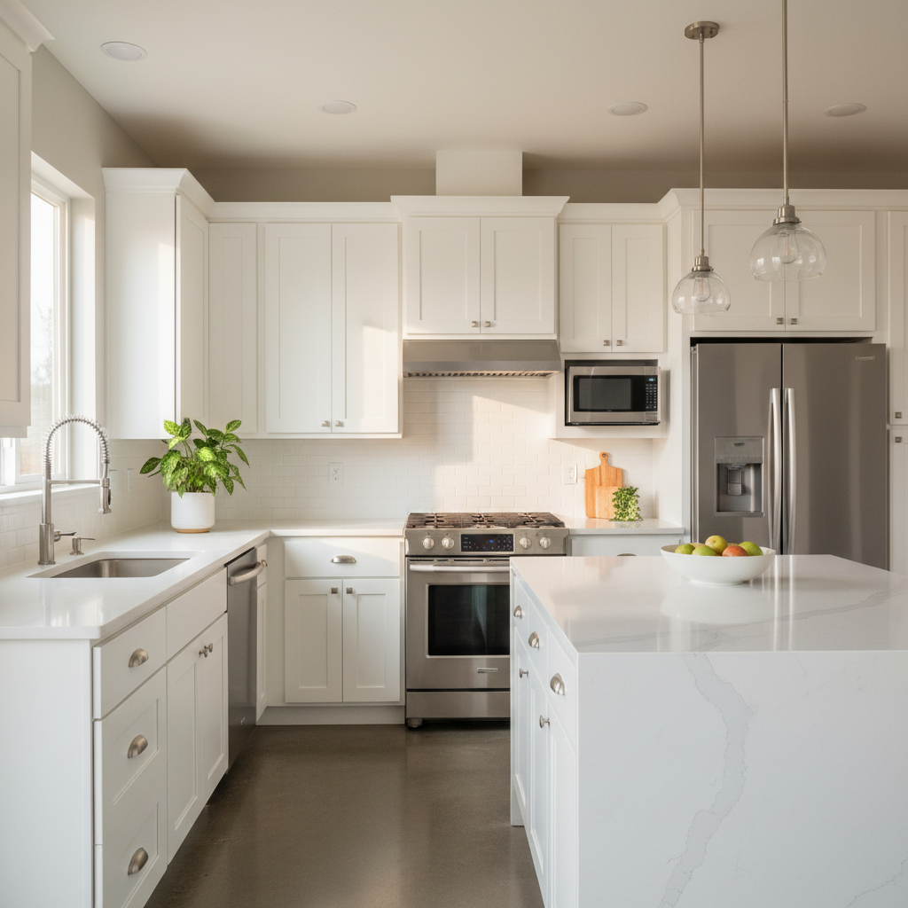

# Timberline Render Library

Reusable AI-generated renders for proposals. Use these before generating new ones — saves time and API calls.

## Available Renders

| File | Use For |
|---|---|
| `kitchen-white-shaker-quartz.png` | Standard kitchen remodel — white shakers, quartz counters, subway tile backsplash |
| `master-bath-glass-enclosure-tile.png` | Master bath — glass enclosure, floor-to-ceiling tile, floating vanity |
| `guest-bath-alcove-tub-subway-tile.png` | Guest bath — alcove tub, subway tile shower walls, clean vanity |
| `living-lvp-paint-blinds.png` | Living/hallway — LVP floors, fresh paint, vinyl blinds |

## Usage in Proposals

Reference with relative path from proposal folder:
```html

```

Or copy to the proposal folder if deploying standalone.

## Adding New Renders

Name descriptively: `[room]-[style]-[key-feature].png`
Examples: `kitchen-green-shaker-gold-hardware.png`, `master-bath-freestanding-tub.png`
